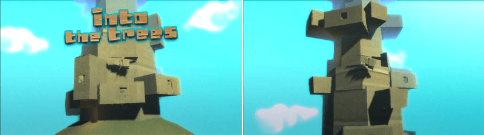
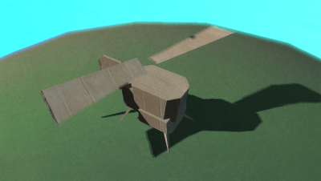
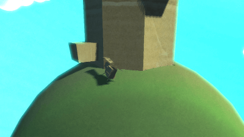
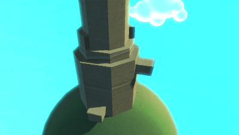
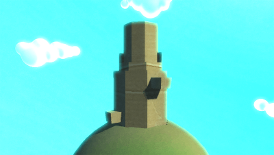

# Space Taxi (3D Remake), aka `Intro the Trees` :helicopter:

This repository contains the prototype code for a 3D remake of the classic game "Space Taxi", using the [Squirrel programming language](https://github.com/albertodemichelis/squirrel) and the (GameStart 3D engine](https://www.youtube.com/@GameStart3D/videos). The game features a physics engine powered by Bullet Physics.

 

 

## :joystick: Game Overview

The game revolves around controlling a helicopter (the player), landing on different platforms ("pads"), and moving between towers (only one tower actually exists).

## Code Structure

The code is divided into several script files, each serving a different purpose:

### Main Scene Script (`Main.nut`)

This script handles the main gameplay logic. It primarily deals with finding and managing pads and the player's helicopter.

- `FindPads(scene)`: This function locates all the pads in the current scene.
- `FindPlayer(scene)`: This function finds the player's helicopter in the scene.
- `CyclePads()`: This function is called every 5 seconds to select a new active pad from the list of all pads. The new pad is different from the current one.
- `OnUpdate(scene)`: This function is called in each frame to update the game state. It triggers the `CyclePads()` function if the player's client is not loaded.

### Tower Scene Script (`Tower.nut`)

The Tower Scene Script is very similar to the Main Scene Script, and it appears to be used for different scenes that have similar gameplay mechanics to the main scene.

### Controller (`Controller.nut`)

This script handles player inputs from either a game controller or the keyboard. The game controller's Axis Z is used for throttle control (acceleration), and Axis X is used for directional control.

### Beacon (`Beacon.nut`)

The Beacon script is a helper for the game camera. It makes the camera follow the player's helicopter in the scene, with a smooth trailing effect.

### Level (`Level.nut`)

This script handles the room transition logic in a level. It maintains a `room_connection` structure that defines how the rooms in a level are connected and where the spawn points in each room are.

## :warning: Notice

This is a legacy codebase that was developed using an older version of the GameStart 3D engine. It is presented here for posterity and to possibly serve as inspiration for similar projects. Note that the code might not work correctly or at all with the current versions of GameStart 3D engine and the Squirrel programming language.
